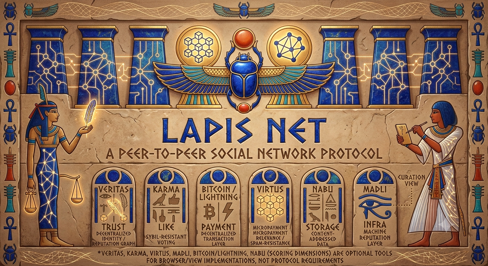

= Lapis Net

Lapis Net is a fully decentralized peer-to-peer social network protocol on the
Kotlin/JVM platform. It is part of the Lapis family of distributed systems,
alongside https://github.com/lapisproject-dev/Lapis-Cloud[Lapis Cloud].

The protocol combines:

* Decentralized identity — secp256k1 keypairs, Bitcoin-compatible
* Content-addressed storage — Nabu (IPFS-on-libp2p), DHT + Bitswap
* Web-of-trust reputation — Veritas, a shortest-path trust graph
* Gossip-based propagation — libp2p GossipSub
* Bitcoin/Lightning-anchored micropayment relevance — Virtus (on-chain OP_RETURN and Lightning BOLT-11 payment proofs)
* Sybil-resistant free "likes" — Karma, weighted by Veritas and a Bitcoin time anchor
* Machine-to-machine infrastructure reputation — Madli, a five-metric weighted-median node-reputation layer

The protocol core is deliberately neutral about curation, sorting, and
reputation models. Veritas, Karma, Virtus, and Madli (the scoring dimensions)
are optional tools for browser/view implementations, not protocol
requirements.

As of *V0.6*, all four scoring dimensions (Veritas, Virtus, Karma, Madli) are
implemented end to end — data models, GossipSub propagation, Nabu persistence,
and (for Virtus) real Bitcoin on-chain and Lightning payment-proof
verification — alongside identity/keystore hardening (Argon2id + AES-256-GCM),
a genuine multi-user Genesis-bootstrap/QR-code connection flow, and a first
real client, the Minimal-Browser (`lapis-net-browser`). See
link:docs/architecture.adoc[docs/architecture.adoc] for full technical detail
and link:docs/roadmap.adoc[docs/roadmap.adoc] for the wave-by-wave history.
Not yet implemented: an embedded Lightning node (proof verification only, no
payment sending), BOLT-12 offer publication, NAT traversal hardening, and
end-to-end/asynchronous messaging (planned next waves).

== Modules

[cols="1,3"]
|===
| Module | Purpose

| `lapis-net-core`
| Base protocol abstractions shared by all other modules.

| `lapis-net-identity`
| secp256k1 identity keypairs, Ed25519 dual-key binding for the libp2p peer ID, keystore encryption at rest (Argon2id + AES-256-GCM), and multi-device/pseudonym self-trust linking.

| `lapis-net-storage`
| DHT + Bitswap content storage via Nabu.

| `lapis-net-trust`
| Veritas (web-of-trust): trust-edge data model, shortest-path scoring algorithm, GossipSub propagation, Nabu persistence.

| `lapis-net-networking`
| libp2p node bootstrap, peer identity derivation, mDNS discovery, GossipSub, and the Genesis-bootstrap/QR-code connection flow.

| `lapis-net-virtus`
| Virtus (the LTR micropayment economy): on-chain (OP_RETURN) and Lightning (BOLT-11) payment proofs, 10%/24h decay, view-specific accumulation.

| `lapis-net-karma`
| Karma (free likes): Bitcoin time-anchored, Veritas-weighted Sybil-resistant "like" scoring.

| `lapis-net-madli`
| Madli (machine-to-machine node reputation): five-metric observation vector with Veritas-weighted, manipulation-resistant weighted-median aggregation.

| `lapis-net-browser`
| Minimal-Browser — the first real Lapis Net client, exposing Veritas/Virtus/Karma/Madli data and the LTR record-authoring endpoints.

| `lapis-net-test`
| Shared test fixtures and helpers used across module test sources, including the multi-node test harness.

| `lapis-net-cli`
| Entry point / multi-node demo harness proving trust propagation end to end.
|===

== Building

[source,bash]
----
./gradlew clean check   # compiles, runs tests, runs ktlint
./gradlew :lapis-net-cli:run
----

Requires JDK 21.

== Development conventions

* Code style is enforced by https://github.com/JLLeitschuh/ktlint-gradle[ktlint] and checked in CI.
* Logging uses https://github.com/oshai/kotlin-logging[kotlin-logging]: `private val logger = KotlinLogging.logger {}` in every file that logs.
* Documentation is written in AsciiDoc; diagrams (once introduced) use kUML via the `kuml` Asciidoctor macro — no PlantUML, Mermaid, or hand-drawn diagrams.
* All identifiers (classes, interfaces, packages) are named in English. Domain terms (Veritas, Karma, Virtus, Madli) are the one exception, as they are Latin proper nouns used directly as identifiers.

See link:docs/architecture.adoc[docs/architecture.adoc] and link:docs/roadmap.adoc[docs/roadmap.adoc] for more.

== License

Apache License 2.0 — see link:LICENSE[LICENSE].

== Contributing

See link:CONTRIBUTING.adoc[CONTRIBUTING.adoc].
